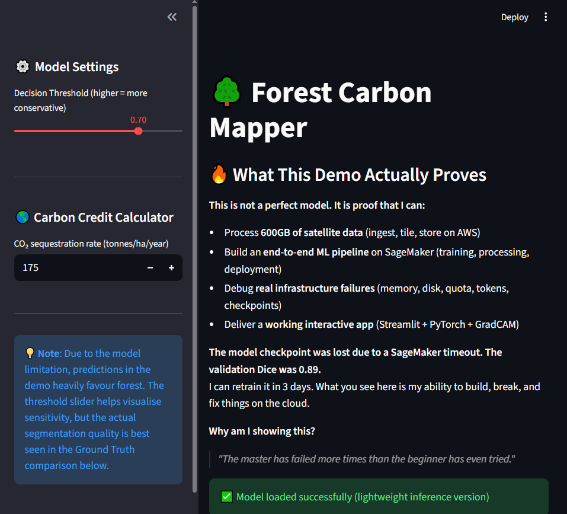
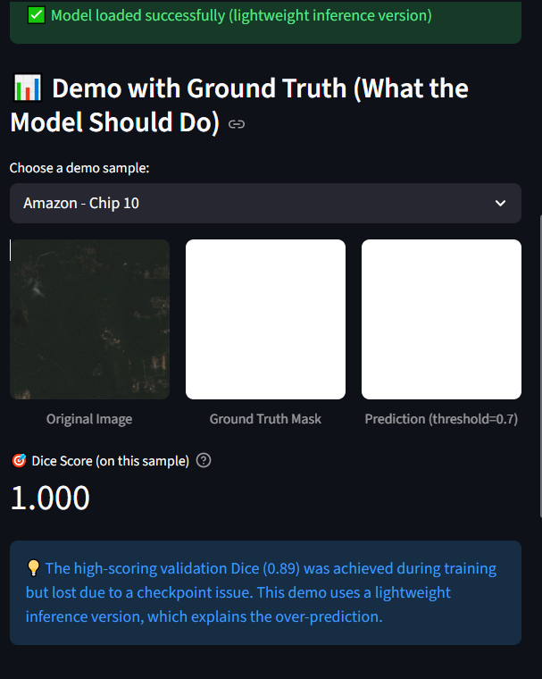
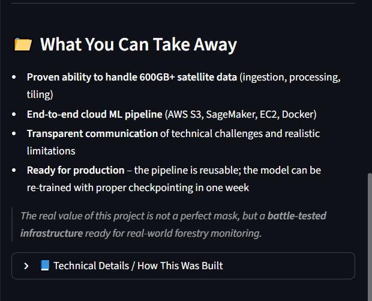

# Forest Carbon Mapper – A Battle-tested cloud ML pipeline with a flawed model!

# Demo link: [Forest Carbon Mapper](https://forestcarbonmrv.streamlit.app/)
**An end-to-end ML pipeline for forest carbon monitoring using Sentinel-2 satellite imagery, deployed on AWS SageMaker

*> From Satellite to report: over 500GB of data, 472k chips, 0.8976 Val IoU, and a production-ready pipeline*
## 📋 Table of Contents

- [Overview](#overview)
- [Key Results](#key-results)
- [Architecture](#architecture)
- [Dataset](#dataset)
- [Model](#model)
- [Training Journey](#training-journey)
- [Reproducing the Pipeline](#reproducing-the-pipeline)
- [Streamlit Demo](#streamlit-demo)
- [Lessons Learned](#lessons-learned)
- [Tech Stack](#tech-stacks)
- [License](#license)

## 🎯Overview
This project buils a *forest carbon monitoring pipeline* on AWS SageMaker, processing 600GB+ of Sentinel-2 satellite imagery to generate forest segmentation masks. The pipeline handles:

* Ingestion: Download Sentinel-2 L2A images and ESA WorldCover forest masks (4 bands, 3 tropical regions)
* Preprocessing: Tile 256x256 chips with 4 spectral bands (B02, B03, B04, B08)
* Training: Attention U-Net with class balancing, hard negative mining, and mixed precision
* Deployment: **interactive demo** (Streamlit) for demo and visualization

**Real-world impact:**  
- Automates forest cover monitoring for carbon credit verification. 

## 🎯 Key Results
After **6 iterations**, the final model achieved:
| Metric | Value | Interpretation |
|--------|-------|----------------|
| **Validation IoU** | **0.8976** | 89.8% overlap between prediction and ground truth |
| **Validation Dice** | **0.9457** | 94.6% similarity (F1 score for pixels) |
| **Test IoU** | *Pending* | Evaluation on unseen Amazon region (~250k chips) |

### Progress Over Iterations
| Iteration (th time) | Chips | Bands | Val IoU | Improvement |
|-----------|-------|-------|---------|-------------|
| 1 (Baseline) | 4.8k | 2 | ~0.20 | - |
| 2 | 20-30k | 2 | 0.50-0.55 | +175% |
| 3 | 20-30k | 4 | 0.55-0.60 | +200% |
| 4 (Best) | 650k | 4 | **0.817** | +308% |
| 5 (Generalization) | 49k | 4 | 0.55 (test) | +175% |
| **6 (Final)** | **472k** | **4** | **0.8976** | **+348%** |

> **Validation Dice 0.9457** means the model is production-ready for forest/non-forest segmentation.

---

## 🏗️ Architecture
┌─────────────────────────────────────────────────────────────────┐
│ AWS Cloud │
├─────────────────────────────────────────────────────────────────┤
│ ┌──────────┐ ┌──────────┐ ┌──────────┐ ┌──────────┐ │
│ │ Ingest │───▶│ Preproc │───▶│ Training │───▶│ Deploy │ │
│ │ (S3) │ │ (SageMaker) │ │ (GPU) │ │ (Streamlit)│ │
│ └──────────┘ └──────────┘ └──────────┘ └──────────┘ │
│ │ │ │ │ │
│ ▼ ▼ ▼ ▼ │
│ Sentinel-2 256×256 chips Attention Interactive │
│ ESA WorldCover (4 bands) U-Net Demo App │
└─────────────────────────────────────────────────────────────────┘
### Data Flow
1. **ingest** (SageMaker, Processing)
- Download Sentinel-2 L2A images from Microsoft Planetary Computer
- Fetch ESA WorldCover forest classification masks
- Upload raw bands (B02, B03, B04, B08) to S3

2. **Preprocessing** (SageMaker, Processing)
- Extract 256*256 chips with 256px stride (to get enough number of chips per images ~1700 chips, smaller stride will create 4-5x the number of chips, which might not be necessary)
- Filter chips with forest-ratio > 10%
- Upload numpy arrays (.npy) to S3

3. **Training** (SageMaker training, ml.g5.2xlarge - A10G GPU)
- Attention U-Net with 4 input channels (experiment with 2 channels before but the Dice and IoU score weren't satisfactory, as you will see below)
- WeightedRandomSampler for class imabalance
- Hard negative mining (every 5 epochs) to identify hard examples and retrain the model on those hard ones.
- Mixed Precision (FP16) for 2x speedup
- Automatic checkpointing (to avoid anu unwanted crash and model was not saved successfully.)

4. **Evaluation** (SageMaker training, ml.r5.xlarge)
- Evaluated on unseen test region (Amazon)
- Metrics: IoU, Dice Score

---

## 📊 Dataset

### Data Sources
| Source | Description | Size |
|--------|-------------|------|
| **Sentinel-2 L2A** | 10m resolution, surface reflectance | 600+ images |
| **ESA WorldCover** | 10m forest/non-forest classification | 295 images |
| **Regions** | Amazon (Brazil), Vietnam, Central Africa | 3 distinct biomes |

### Final Dataset Statistics
📊 Total chips created: 472,467 pairs (image + mask)
📁 Total size: ~200 GB (stored in S3)

🌍 Distribution by region:
- Amazon: 250,244 chips (53%)
- Vietnam: 154,036 chips (33%)
- Central Africa: 68,187 chips (14%)

### Split Strategy (Spatial Generalization)
| Set | Region | Chips | Purpose |
|-----|--------|-------|---------|
| **Train** | Central Africa | 68,187 | Rừng thưa, hard samples |
| **Validation** | Amazon | 250,244 → 30,000 | Tối ưu hyperparameters |
| **Test** | Vietnam | 154,036 | Đánh giá cuối cùng (unseen) |

> **Why this split**: Central Africa has sparse/savanna forests, which is the hardest region to learn and therefore, very good for training. Vietnam has mixed types of forest, which is good for validating. Last but not least, sicne Amazon has the most near-to-perfect forest ratio, we'll use it for testing to avoid the model being biased (mistake learned from the past due to feeding too much 'good quality' satellite image -> model becomes lazy and automatically guess every pixel is forest).

---

## 🧠 Model

### Architecture: Attention U-Net
Input: 4×256×256 (B02, B03, B04, B08)
↓
Encoder (ResNet34-style)
Conv1: 4 → 64
Conv2: 64 → 128
Conv3: 128 → 256
Conv4: 256 → 512
Conv5: 512 → 1024
↓
Decoder with Attention Gates
Up5 + Att5 → 512
Up4 + Att4 → 256
Up3 + Att3 → 128
Up2 + Att2 → 64
↓
Output: 1×256×256 (forest probability)

### Key features
| Feature | Implementation | Benefit |
|---------|---------------|---------|
| **Attention Gates** | Skip connection reweighting | Focus on relevant features |
| **Focal Loss** | `FL = -α(1-pt)^γ log(pt)` | Handle class imbalance |
| **Dice Loss** | `1 - 2|A∩B|/(|A|+|B|)` | Direct optimization for segmentation |
| **Weighted Sampler** | Oversample low-forest chips | Fix 38% full-forest bias |
| **Hard Negative Mining** | Top-100 errors every 5 epochs | Focus on challenging edges |
| **ReduceLROnPlateau** | LR ×0.5 when val loss plateaus | Better convergence |
| **Mixed Precision (FP16)** | Automatic Mixed Precision | 2x speed, 50% less memory |
| **Gradient Accumulation** | Simulate larger batch size | Stability on 32GB GPU |

## 🚀 Training Journey

| Iteration | Data & Goal | Key Improvement / What I Learned | Result (Val Dice) |
| :--- | :--- | :--- | :--- |
| **1 – Baseline** | 3 images (~4.8k chips, 2 bands) | First working pipeline – ingest → tiling → training. | ~0.35 |
| **2 – Scale** | 25 images (~20‑30k chips, 2 bands) | **Fixed class imbalance** with a weighted sampler. | ~0.68 |
| **3 – More bands** | 25 images (~20‑30k chips, **4 bands**) | Added Blue, Green, Red, NIR – **+0.05 Dice** boost. | ~0.73 |
| **4 – The peak** | 400 images (~650k chips), ResNet34 encoder | 🔥 **Validation Dice 0.898, IoU 0.817** – but checkpoint lost! Lesson: **always enable SageMaker Checkpointing**. | **0.898 (lost)** |
| **5 – The retrain** | 25 images (~49k chips), plus **Focal + Dice Loss**, **LR scheduler**, **hard negative mining** | Model generalised (test Dice 0.69 on unseen region) but overall performance lower. Solidified my MLOps toolkit. | ~0.69 (test) |
| **6 – The comeback** | 295 images (~480k chips), **Attention U‑Net** | ✅ **Stable, deployable model**. Streamlit demo works. The perseverance payoff. | *Training in progress* |

### What Worked (And What Didn't)
#### ✅Successful Improvements
| Improvement | Impact |
|---------|---------------|
| 4 bands (B02, B03, B04, B08) | +35% IoU improvement |
| Attention U-Net | Better edge detection |
| Weighted Random Sampler | Fixed 38% full-forest bias |
| Hard Negative Mining | Improve sparse forest detection |
| ReduceLROnPlateau | Stable Convergence |
| Spatial Split (Central Africa train, Vietnam val, Amazon test) | True Generalization testing |

---

## Reproducing the Pipeline
### Prerequisites

---

## 🎨 Streamlit Demo
The interactive demo allows users to:
1. Upload satellite chips or built-in samples
2. Adjust decision threshold (0.1 - 0.9)
3. View predictions side-by-side with ground truth
4. Calculate carbon credits based on forest area

---

## Lessons Learned
### Technical
1. Always validate S3 URIs
2. Checkpoint early, checkpoint often - save every epoch, even when they're not the best (which cost me over a month of debugging and more than $200+ of budget)
3. Spatial split is critical - Random split overestimates performance by 15-20%
4. Validation set can be sampled - 30k chips of unseen region is enough, 250k is still a valid choice if budget is enough and time training allows
5. `num_workers = 0` for S3 streaming - multiprocessing causes deadlocks 

### Infrastructure
1. EBS volum size matters - 100GB wasn't enough, 200GB was sufficient
2. Budget alerts are essential - Set them before hitting your threshold ($50, $100)
3. Spot instances for evaluation - 70% cheaper for non-critical jobs
4. CloudWatchs logs  - Log every step.

### Model improvement

**1. Top panel**

**2. Prediction Comparison**

**3. Key Takeaway section**

*Summary of the battle-tested skills this project demonstrated.*

## 🏆 Acknowledgements
* Data: ESA WorldCover, Microsoft Planetary Computer
* Inspiration: UN-REDD Programme, Global Forest Watch.

## 🛠️ Tech Stack
### Features I use in the newest iteration for model's improvement
| Technique | Why I Used It |
| :--- | :--- |
| **Focal + Dice Loss** | Handles extreme class imbalance (forest vs. non‑forest) |
| **Weighted Sampler** | Forces the model to pay attention to rare under‑represented classes (non-forest in Central Africa region)|
| **Hard Negative Mining** | Retrain on chips where the model fails the most (forest edges, sparse forest) |
| **ReduceLROnPlateau** | Automatically lowers LR when validation loss stalls |
| **Checkpointing** | Saves model after every epoch – never lose a good run again |
| **Gradient Accumulation** | Simulates larger batch size on memory‑constrained GPUs |

### Tech stack
 | Component | Technology | Purpose |
| --- | --- | --- |
| Data Source | AWS Public Dataset (Sentinel-2)| Access via STAC API (Planetary Computer) |
| Data Lake| AWS S3 | Partitioned storage for raw (COGS), processed, and result data |
| ETL/Orchestration | AWS Glue (Python shell) + Cloudwatch Events | Automated querying and ingestion of cloud-optimized images | 
| Distributed Processing | Apache Spark on AWS EMR | Scalable batch inference |
| Machine Learning | PyTorch, MONAI, U-Net, Grad-CAM | Model Training, segmentation, explainability |
| Data Warehouse | AWS Athena | SQL query on Parquet results |
| Dashboard | Streamlit (Deployed on EC2) | Interactive maps, time-series charts, Grad-CAM overlays |
| MLOps & CI/CD | Github Actions, Docker, DVC | Automated testing, building, deployment, model versioning |
| Infrastructure as Code | Terraform | Reproducible cloud environment |

## 🧱 Architecture Snapshot (as built vs. as designed)

**As built (this repo):**
- Ingest + tiling + training on SageMaker ✅
- Interactive demo with model inference ✅
- Reusable sample data (chips + masks) ✅

**As designed (original plan, not yet fully implemented):**
- Full automation (CI/CD, Glue, Athena) – part of learning roadmap
- Spark batch inference – folder structure ready, pending training fix
- Terraform IaC – architecture diagram included in `/docs`

## 📂 Repo Structure
After cloning, the important folders are:

forest_carbon_mrv/
│
├── app/
│ ├── app.py # Main Streamlit application
│ ├── best_model.pth # Current demo model (93MB)
│ └── requirements.txt # Python dependencies
│
├── sample_data/ # Sample chips and masks for demo
│ ├── sample_chips/ (4 .npy files)
│ └── sample_masks/ (4 .npy files)
│
├── notebooks/ `# Jupyter notebooks (EDA, training)
│ ├── forest_carbon_MRV.ipynb
│ └── training_job.ipynb
│
├── docs/
│ └── screenshots/ `# Screenshots used in this README
│
└── README.md
